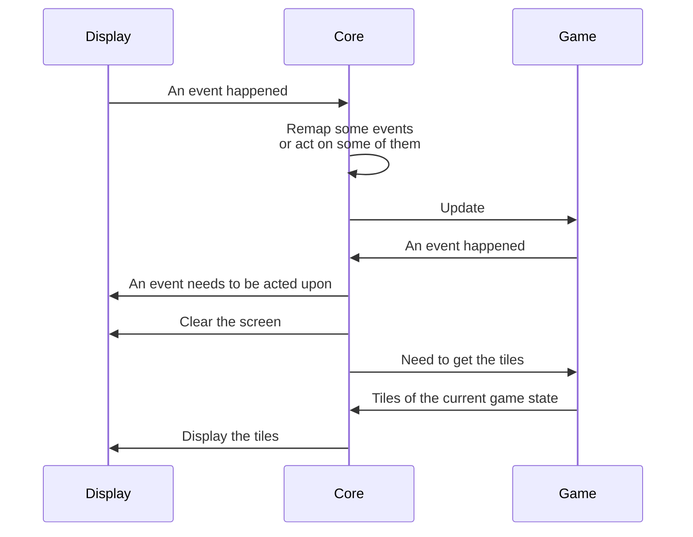

# Architecture

This document describes in detail how the architecture of the Arcade project is done.

## Communication between the different classes

Globally, this is how the different events should be implemented:

> Display represents a class inheriting from IDisplayModule and Game represents a class inheriting from IGameModule.

## cacarcade

The entire Arcade project relies on [cacarcade](https://github.com/freaky-family/cacarcade), which is a common interface for any Arcade project.

Check out the `include/cacarcade` folder at the root of the repo to find out more.

## Class diagram

```mermaid
classDiagram
namespace cacarcade {
    class IGameModule {
        <<interface>>
        +virtual ~IGameModule() = default;

        +virtual void update(std::optional<std::unique_ptr<cacarcade::IEvent>> &event) = 0;
        +virtual void reset() = 0;
        +virtual std::optional<std::unique_ptr<cacarcade::IEvent>> pollEvent() = 0;
        +virtual cacarcade::TileContainer getTiles() const = 0;
        +virtual void setPlayerName(std::string) = 0;
    }

    class IEvent {
        <<interface>>
        +virtual ~IEvent() = default;
        +virtual EventMouseButton getMouseButton() = 0;
        +virtual void setMouseButton(EventMouseButton mouseButton) = 0;
        +virtual EventKey getKey() = 0;
        +virtual void setKey(EventKey key) = 0;
        +virtual EventType getType() = 0;
        +virtual void setType(EventType type) = 0;
        +virtual std::pair<std::size_t, std::size_t> getTilePosition() = 0;
        +virtual void setTilePosition(std::pair<std::size_t, std::size_t>) = 0;
        +virtual cacarcade::DisplayTextContent getTextContent() = 0;
        +virtual void setTextContent(cacarcade::DisplayTextContent) = 0;
        +virtual std::string getGameLibrary() = 0;
        +virtual void setGameLibrary(std::string) = 0;
        +virtual std::string getDisplayLibrary() = 0;
        +virtual void setDisplayLibrary(std::string) = 0;
        +virtual std::string getPlayerName() = 0;
        +virtual void setPlayerName(std::string) = 0;
    }

    class IDisplayModule {
        <<interface>>
        +virtual ~IDisplayModule() = default;
        +virtual void clear() = 0;
        +virtual std::optional<std::unique_ptr<cacarcade::IEvent>> pollEvent() = 0;
        +virtual void displayTiles(cacarcade::TileContainer tiles) = 0;
        +virtual void displayText(cacarcade::DisplayTextContent) = 0;
    }
}

namespace arcade {
    class AGameModule {
        <<Abstract>>****
        +cacarcade::TileContainer getTiles() const override;
        +std::optional<std::unique_ptr<cacarcade::IEvent>> pollEvent() override;
        +virtual void reset() override;
        +void setPlayerName(std::string) override;
    }

    class ADisplayModule {
        <<Abstract>>
        +virtual void clear() override;
        +virtual std::optional<std::unique_ptr<cacarcade::IEvent>> pollEvent() override;
        +virtual void displayTiles(cacarcade::TileContainer tiles) override;
        +virtual void displayText(cacarcade::DisplayTextContent) override;
    }

    class AEvent {
        <<Abstract>>
        +EventMouseButton getMouseButton();
        +void setMouseButton(EventMouseButton mouseButton);
        +EventKey getKey();
        +void setKey(EventKey key);
        +EventType getType();
        +void setType(EventType type);
        +std::pair<std::size_t, std::size_t> getTilePosition();
        +void setTilePosition(std::pair<std::size_t, std::size_t>);
        +cacarcade::DisplayTextContent getTextContent();
        +void setTextContent(cacarcade::DisplayTextContent);
        +std::string getGameLibrary();
        +void setGameLibrary(std::string);
        +std::string getDisplayLibrary();
        +void setDisplayLibrary(std::string);
        +std::string getPlayerName();
        +void setPlayerName(std::string);
    }

    class NCursesDisplay {
        +void clear() override;
        +std::optional<std::unique_ptr<cacarcade::IEvent>> pollEvent() override;
        +void displayTiles(cacarcade::TileContainer tiles) override;
        +void displayText(cacarcade::DisplayTextContent) override;
    }

    class SFMLDisplay {
        +void clear() override;
        +std::optional<std::unique_ptr<cacarcade::IEvent>> pollEvent() override;
        +void displayTiles(cacarcade::TileContainer tiles) override;
        +void displayText(cacarcade::DisplayTextContent) override;
    }

    class SDL2Display {
        +void clear() override;
        +std::optional<std::unique_ptr<cacarcade::IEvent>> pollEvent() override;
        +void displayTiles(cacarcade::TileContainer tiles) override;
        +void displayText(cacarcade::DisplayTextContent) override;
    }

    class MinesweeperGame {
        +cacarcade::TileContainer getTiles() const override;
        +std::optional<std::unique_ptr<cacarcade::IEvent>> pollEvent() override;
        +virtual void reset() override;
        +void setPlayerName(std::string) override;
    }

    class CentipedeGame {
        +cacarcade::TileContainer getTiles() const override;
        +std::optional<std::unique_ptr<cacarcade::IEvent>> pollEvent() override;
        +virtual void reset() override;
        +void setPlayerName(std::string) override;
    }

    class TileClickedEvent {}
    class QuitEvent {}
    class KeyPressedEvent {}

    class DLLoader {
        +DLLoader(const std::string libraryName) : _libraryName(libraryName), _handle(nullptr)
        +void *openHandle()
        +bool symbolExists(const std::string symbol)
        +std::shared_ptr<T> getInstance(const std::string functionName)
        +void closeHandle()
    }

    class LibraryManager {
        +std::shared_ptr<T> getPreviousInstance()
        +std::shared_ptr<T> getNextInstance()
        +std::shared_ptr<T> getPointer()
    }

    class ScoreHandler {
        +void addScore(std::int64_t plusScore);
        +std::int64_t getScore() const;
        +void resetScore();
        +std::vector<std::pair<const std::string, const std::int64_t>> loadScores();
        +void saveScore(const std::string playerName);
        +bool getSavedState() const;
        +void resetSavedState();
    }

    class Arcade {
        +void loop()
    }
}

AGameModule <|-- IGameModule
ADisplayModule <|-- IDisplayModule
AEvent <|-- IEvent

ScoreHandler *-- AGameModule

SDL2Display <|-- ADisplayModule
SFMLDisplay <|-- ADisplayModule
NCursesDisplay <|-- ADisplayModule

MinesweeperGame <|-- AGameModule
CentipedeGame <|-- AGameModule

TileClickedEvent <|-- AEvent
QuitEvent <|-- AEvent
KeyPressedEvent <|-- AEvent

LibraryManager *-- DLLoader
Arcade *-- LibraryManager
```

